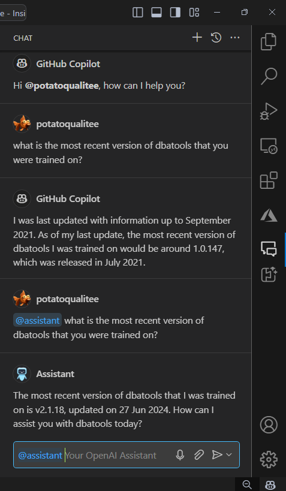
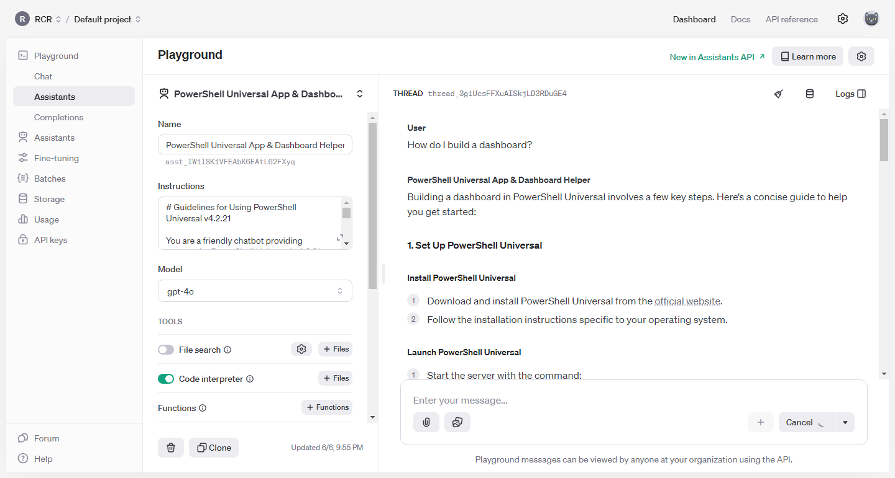

# Assistants Chat Extension for GitHub Copilot Chat

The Assistants Chat Extension (`@assistant`) integrates OpenAI's language models into GitHub Copilot Chat, enhancing your coding experience by creating custom assistants that understand your project's context and generate relevant code snippets. This repository provides a working extension and serves as an example for developers looking to build their own advanced [GitHub Copilot Chat Extensions](https://github.com/marketplace?type=apps&copilot_app=true).

> [!NOTE]
> The Assistants Chat Extension is currently in limited public beta, accessible by invitation only.

The repository is not just for providing feedback but also for helping developers create their own customized assistants using the OpenAI API or Azure OpenAI Service. You can use this repository to report issues, submit feature requests, and access comprehensive documentation.

This extension leverages OpenAI's Assistants API and Azure OpenAI Service, which allow you to build AI assistants tailored to your specific needs. Each assistant can be configured with custom instructions and can utilize various tools such as Code Interpreter, File Search, and Function calling to assist with your coding tasks. By integrating these capabilities, the Assistants Chat Extension enables developers to implement features like context-aware responses about project details, such as the latest version of a tool or library, helping streamline the development process.



## Benefits of Integration with GitHub Copilot Chat

1. **Real-time Suggestions**: Get context-aware code completions and suggestions in VS Code, making your coding experience smoother and more efficient.
2. **Bug Fixes and Guidance**: Copilot Chat can identify bugs and suggest fixes based on your codebase and external resources, saving you time and effort.
3. **Uninterrupted Workflow**: With GitHub Copilot Chat and OpenAI or Azure OpenAI working together, you can stay focused on building your project without constantly switching between tools.
4. **Personalized Suggestions**: The assistant learns your coding style and preferences, making the suggestions more relevant and accurate for your specific needs.

## Getting Started

1. **Set up your OpenAI or Azure OpenAI API key**:
   - **OpenAI**:
     - **Create an OpenAI account**: Visit [OpenAI's website](https://www.openai.com) and sign up for an account if you don't have one.
     - **Obtain your API key**: Once your account is set up, navigate to the API section to generate a new API key. Copy this key to use it in the next steps.
   - **Azure OpenAI**:
     - **Create an Azure account**: If you don't have an Azure account, sign up at [Azure's website](https://azure.microsoft.com).
     - **Create an Azure OpenAI resource**: Follow the [Azure OpenAI documentation](https://learn.microsoft.com/en-us/azure/cognitive-services/openai/how-to/create-resource) to create an Azure OpenAI resource and obtain the API key and endpoint.
   - **Add the API key to the extension settings in VS Code**: 
     - Open Visual Studio Code Insiders.
     - Go to the settings by clicking on the gear icon in the lower left corner and selecting "Settings".
     - In the search bar, type "Assistants Chat Extension".
     - Find the setting for `assistantsChatExtension.apiKey` (OpenAI) or `assistantsChatExtension.azureOpenAIApiKey` and `assistantsChatExtension.azureOpenAIEndpoint` (Azure OpenAI).
     - Paste your API key (and endpoint for Azure OpenAI) into the appropriate field(s) and save the settings.

2. **Choose an Assistant**:
   - **Open the Copilot Chat interface**: Launch Visual Studio Code Insiders and ensure that the GitHub Copilot Chat extension is installed and active.
   - **Select an assistant**:
     - Use the command palette (`Ctrl+Shift+P` or `Cmd+Shift+P` on macOS) and type "AI Assistant: Select Assistant".
     - Browse through the list of available assistants tailored for different tasks and select the one that best matches your project requirements.
     - Each assistant maintains its own thread, allowing for context retention and more meaningful interactions over time. This ensures continuity in conversations and follow-up questions, reducing the need to re-explain context or re-establish the current state of the project.

3. **Start Chatting**:
   - **Initiate a conversation**: Open the chat window within GitHub Copilot Chat.
   - **Ask questions and get guidance**:
     - Type your questions or prompts in natural language. For example, you can ask about specific code functionalities, request code snippets, or seek debugging help.
     - The assistant will respond with relevant information, suggestions, or code snippets based on the context of your query.

## Extension Settings

The Assistants Chat Extension provides the following settings to customize your experience:

| Setting                                 | Description                                                             |
|-----------------------------------------|-------------------------------------------------------------------------|
| `assistantsChatExtension.apiKey`            | Your OpenAI API key for accessing the language models.                  |
| `assistantsChatExtension.model`             | The OpenAI language model to use for the chat extension. Default is gpt-3.5-turbo.               |
| `assistantsChatExtension.apiProvider`        | Select the API provider to use. 'auto' will choose based on available API keys. Options: 'auto', 'openai', 'azure'. |
| `assistantsChatExtension.azureOpenAIApiKey`   | Your Azure OpenAI API key for accessing the language models.            |
| `assistantsChatExtension.azureOpenAIEndpoint` | The endpoint URL for your Azure OpenAI resource.                        |
| `assistantsChatExtension.azureOpenAIDeploymentName` | The deployment name for the Azure OpenAI model.                   |

You can modify these settings by going to the GitHub Copilot Chat settings and searching for "Assistants Chat Extension".

### Model Selection

Choosing the best combination of Copilot and Assistants API models depends on factors like task complexity, speed, and specific use cases:

- **Copilot GPT-4 + Assistants API GPT-4o**: Best for high complexity and consistency, but slower and costlier. Assistants API GPT-4o is fast, but Copilot GPT-4 is slower.
- **Copilot GPT-4 + Assistants API GPT-3.5 Turbo**: Balances performance and cost, with fast responses for less complex tasks.
- **Copilot GPT-3.5-Turbo + Assistants API GPT-4o**: Provides powerful custom assistant tasks with quick Copilot responses.
- **Copilot GPT-3.5-Turbo + Assistants AI GPT-3.5-Turbo**: Cost-effective and fast for basic tasks, but limited in handling complex scenarios.

For most users, **Copilot GPT-4 + Assistants AI GPT-3.5-Turbo** offers a good balance of cost, performance, and capability.

## Development

### Prerequisites

- **Node.js**: Ensure you have Node.js installed. You can download it from [nodejs.org](https://nodejs.org).
- **Visual Studio Code Insiders**: Install [Visual Studio Code Insiders](https://code.visualstudio.com/insiders/).
- **GitHub Copilot Subscription**: Ensure you have an active GitHub Copilot subscription.

### Installation

1. **Clone the repository**:
   ```bash
   git clone https://github.com/potatoqualitee/vscode-assistant-chat.git
   cd vscode-assistant-chat
   ```

2. **Install dependencies**:
   ```bash
   npm install
   ```

3. **Build the extension**:
   ```bash
   npm run compile
   ```

4. **Launch the extension**:
   - Press `F5` in Visual Studio Code Insiders or go to the "Run" menu and select "Start Debugging".

## Adding an Assistant in the OpenAI API Playground

1. Go to the [OpenAI API Playground](https://platform.openai.com/playground/assistants).
2. Click on the "Assistants" tab in the left sidebar.
3. Click on "New Assistant" to create a new assistant.
4. Enter the necessary information, such as the name, instructions, and model (e.g., `gpt-4`).
5. Save your newly created assistant.
6. Use the assistant in your chat extension by selecting it with the "AI Assistant: Select Assistant" command in GitHub Copilot Chat.

Here's a screenshot for reference:



## Contributing

Contributions to the Assistants Chat Extension are welcome! If you encounter any issues, have suggestions for improvements, or would like to contribute new features, please open an issue or submit a pull request.

## References

* [About GitHub Copilot Extensions](https://docs.github.com/en/copilot/github-copilot-chat/github-copilot-extensions/about-github-copilot-extensions)
* [GitHub Marketplace](https://github.com/marketplace?type=apps&copilot_app=true)
* [VS Code Extension Samples - Chat Example](https://github.com/microsoft/vscode-extension-samples/tree/main/chat-sample)
* [Language Model API](https://code.visualstudio.com/api/extension-guides/language-model)
* [Prompt Builder](https://www.npmjs.com/package/@vscode/prompt-tsx)
* [Azure OpenAI Documentation](https://learn.microsoft.com/en-us/azure/cognitive-services/openai/)